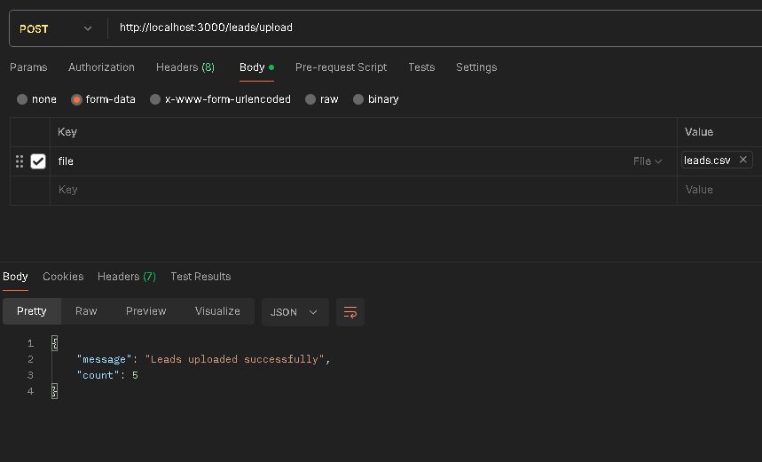
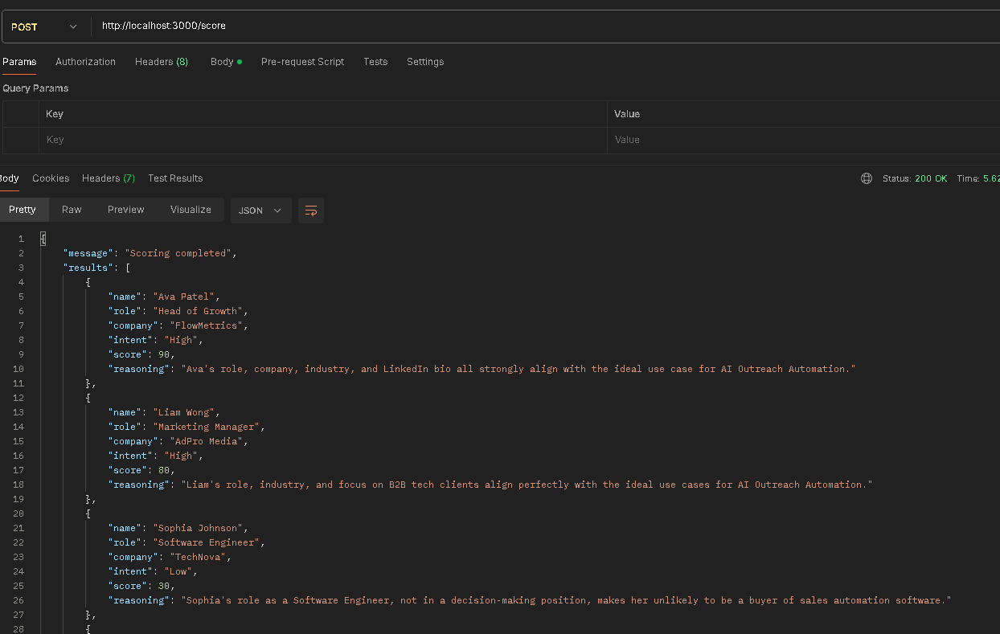
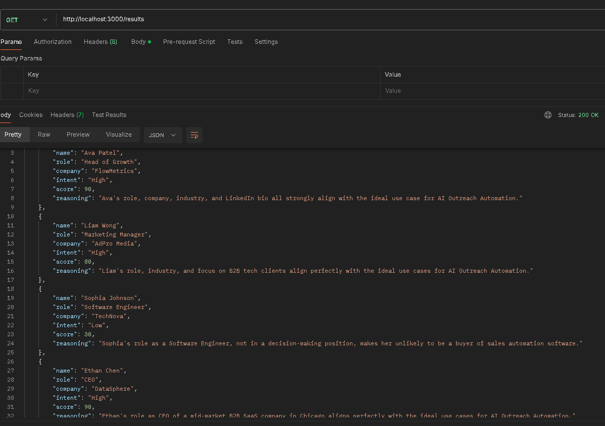

# 🎯 Lead Scoring & Intent Classification API

This project provides a backend service to score and classify sales leads using both **rule-based logic** and **AI-powered intent detection** (Google Gemini API).  
The system allows uploading offer and lead data, scoring them, and exporting results in JSON or CSV format.

---

## 📂 Project Structure

```
├── controllers
│   ├── InputController.js    # Manages input data (offer + leads)
│   ├── AiClient.js    # AI intent classification using Gemini
│   └── ScorePipeline.js      # Combines rule-based + AI scoring
├── Routes                # API routes
├── index.js                 # Express server entry point
└── README.md                 # Project documentation
```

---

## ⚙️ Features

- Upload offers and leads JSON data  
- Rule-based scoring system (role relevance, industry match, completeness)  
- AI-powered **intent classification** (`High`, `Medium`, `Low`)  
- Get results in **JSON format**  
- Export results as **CSV file download**  

---

## 🚀 Getting Started

### 1️⃣ Install Dependencies

```bash
npm install
```

### 2️⃣ Environment Variables

Create a `.env` file in the root and add your Gemini API key:

```ini
GEMINI_API_KEY=your_api_key_here
```

### 3️⃣ Run Server

```bash
npm run serve
```

Default server runs on:  
[http://localhost:3000](http://localhost:3000)

---

## 📡 API Endpoints

### ➕ Accepts json with offer details Data

**POST** `/offer`  
Upload `offer.json`




---

### ➕ Uploads csv file

**POST** `/leads/upload`  
Upload `leads.csv`


---

### 🏆 Run Lead Scoring

**POST** `/score`  
Processes leads using rules + AI intent.

**Response:**
```json
{
  "message": "Scoring completed",
  "results": [
    {
      "name": "John Doe",
      "role": "CEO",
      "company": "TechCorp",
      "intent": "High",
      "score": 80,
      "reasoning": "Strong match between role and offer."
    }
  ]
}
```


---

### 📊 Get Results

**GET** `/results`  
Returns previously calculated scoring results in JSON.



---

### 📥 Download CSV

**GET** `/results/export`  
Downloads the scoring results as a CSV file.


---

## 📌 Tech Stack

- **Node.js + Express** – Server & Routing
- **Google Gemini API** – AI-powered lead intent classification
- **json2csv** – CSV export

---